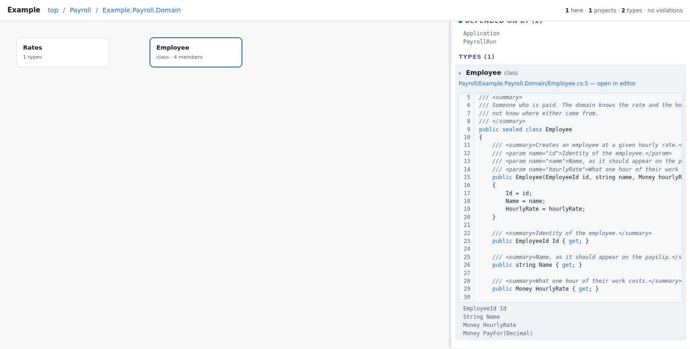
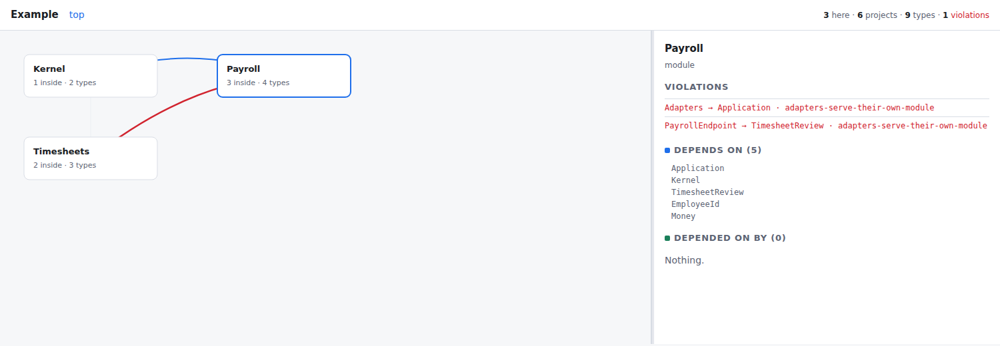

# arch-viewer

Look at the structure of a .NET solution instead of reading its code.

`arch-viewer` reads a repository and draws it as a graph you can drill into:
container → nested container → type → member → source. Dependencies that
break your own rules are drawn in red, labelled with the rule they break.



**Status: early but working.** The extractor and the viewer run. Types,
members and jump-to-source work when the repository has been built. Not yet
done: measured metrics, what-if proposals, extractors for other ecosystems.
See [docs/spec.md](docs/spec.md).

---

## Why this exists

When agents write most of the code, reading every diff stops working. The
volume is wrong, and the reviewer becomes the bottleneck.

What still works is looking at *shape*: which components exist, what depends
on what, and where a dependency now points the wrong way. Shape changes
slowly, it fits on a screen, and a violation in it is a real defect rather
than a matter of taste.

This tool shows that shape. It is most useful when someone — or something —
is changing the code faster than you can read it.

It does not review code, score it, or rank it. It shows structure and marks
the dependencies you declared illegal.

## Credit where it is due

The idea is Robert C. Martin's. He built
[`unclebob/uml-viewer`](https://github.com/unclebob/uml-viewer) — a live
Clojure/Quil viewer driven by an EDN intermediate representation — and
described using it, together with a deterministic checker, in place of
reading agent-written code.

Several of its design decisions are taken deliberately:

- the model is **generated**, the policy is **hand-written** — agents edit
  the policy, never the model;
- containers nest to arbitrary depth, so the same mechanism serves very
  different project layouts;
- source is shown as a **fragment**, not a whole file;
- metrics arrive as **separate measured snapshots** and are overlaid on load.

No code is copied from it. `uml-viewer` carries no license, which means its
source may be read but not reused — an important detail for anyone tempted
to borrow from it. This project is an independent implementation in C#.

[`fmatar/archlens`](https://github.com/fmatar/archlens) explores the same
idea for other languages.

## What makes this one different

**It can see a composition root.** Wiring stated as `AddScoped<IThing, Thing>()`
appears nowhere in the shape of the class that registers it — only in the
instruction. Those generic arguments are read from the instruction stream, on
request, and become edges of their own kind, so a rule can say "nothing but the
root may reference the implementations" and have it mean something.

**It says what it cannot read.** A repository often holds more than one
ecosystem — a Python test harness, a TypeScript client — and an extractor that
knows .NET projects leaves those out entirely. Every run names them: which
directories hold code it did not read, in what language, and how much. A
missing area that announces itself is a limit; one that says nothing is a lie.

**It targets .NET, and reads metadata rather than text.** Project references
come from `.csproj` files; types and members come from assembly metadata via
`MetadataLoadContext`, which reads compiled assemblies without executing
them; file and line come from portable PDBs. No regular expressions
pretending to be a parser, so `partial` types, generics, nested types and
file-scoped namespaces are not guessed at.

**Structure below the project is visible.** Where one project means one
boundary, the graph of project references is the architecture. Where five
projects hold four hundred types, it is seven arrows that say nothing, and the
architecture lives in the namespaces — so types group by namespace, and what
they inherit, implement and hold becomes edges a rule can constrain.

**Rules work in both directions.** A whitelist says what a component may
reach. The invariant usually worth protecting is the other one — "this is
reached through exactly one door" — and it breaks when somebody new starts
depending on something old, which no whitelist elsewhere would notice.

**Rules are two-dimensional.** A layered model where every component has a
single rank can express "this layer may not reference that layer". It cannot
express "an adapter may reference *its own* application layer and no other",
because "its own" is a second axis. Here a node carries both its container
path and its role, so rules can speak about both.

**Another tool's graph can be borrowed, and is labelled.** Metadata cannot see
inside a method, so what a signature accepts and returns is invisible — which
for a transport layer is most of its coupling. Where a graph from another tool
lies beside the repository, those references can be read from it: drawn dashed,
counted apart, carrying the name of where they came from, and refusable by any
rule. Evidence of a different kind is never quietly mixed in.

**Nothing unmeasured is displayed.** Colour means a rule violation, which is
computed. Coverage, cyclomatic complexity and mutation results appear only
when a snapshot that actually measured them is supplied. A metric nobody
measured is worse than no metric, because it is trusted exactly where
reading the code was skipped.

## How it works

Three parts, deliberately separate:

| Part | Does | Knows about |
|---|---|---|
| extractor | reads a repository, writes a model file | one language/ecosystem |
| policy | declares grouping and forbidden dependencies | your architecture |
| viewer | draws the model, drills down, marks violations | neither |

The viewer never learns a language. Supporting a new ecosystem means writing
an extractor that emits the same model file — the viewer is not touched.
That is the design's one real test: if a differently organised repository
cannot be rendered without changing the viewer, the separation is not there.

## More than one language

The viewer knows no language — it nests containers, expands them and draws
arrows between whatever the model names. An ecosystem is supported by writing
an extractor that emits the same model file, in that language and with that
language's own parser.

| Ecosystem | Extractor | Dependencies |
|---|---|---|
| .NET | `src/ArchViewer.Extract` | one, from Microsoft |
| Python | `extractors/python` | none — `ast` ships with the language |
| TypeScript, JavaScript | `extractors/typescript` | none — the target repository's own compiler is used |
| PHP | `extractors/php` | none required; uses `nikic/PHP-Parser` when it is there |

```bash
python3 extractors/python/archview_python.py <repository> --out arch.html
node     extractors/typescript/archview-ts.mjs <repository> --out arch.html
php      extractors/php/archview-php.php <repository> --out arch.html
```

**One repository, one map.** A .NET solution with a TypeScript client is two
extractions and would be two pages; `merge` makes them one:

```bash
archview <repo> --out dotnet.html
node extractors/typescript/archview-ts.mjs <repo>/client --out client.html --title "client"
archview merge dotnet.json client.json --out arch.html --title "<repo>"
```

Each part keeps its own container and its own kinds. They are not blended: a
namespace of one ecosystem and a folder of another are different things, and
putting them on one row unlabelled is a mistake this repository has made once
and written down.

Proven on a Django repository of 442 modules and 425 classes: **the viewer was
not changed by a single line** to draw it.

## Running it

On Windows, see [docs/WINDOWS.md](docs/WINDOWS.md).

```bash
dotnet build src/ArchViewer.Extract/ArchViewer.Extract.csproj
dotnet src/ArchViewer.Extract/bin/Debug/net10.0/archview.dll <repository> --out arch.html
```

Open `arch.html`. It is one self-contained file with the model embedded, so
it works from disk with no server.

A repository that has been built gives types, members and source lines. One
that has not still gives the graph — grouping falls back to directory and
project names, and the page says types are missing rather than pretending
there are none.

Put a policy at `<repository>/.arch-viewer/policy.json`, or pass `--policy`.
With no policy at all, projects are grouped by their top-level directory.

Try it on the bundled example:

```bash
dotnet src/ArchViewer.Extract/bin/Debug/net10.0/archview.dll examples/solution --out example.html
```

Six projects, eight references, one nested namespace in each domain, and
exactly one crossing drawn red — the adapter that reaches into another
module's application layer. It is recorded twice, once between the projects
and once between the types, because both are true; it is one boundary
broken, and counted as one:



The panel names the rule that was broken, not merely that something was. A red
arrow you cannot act on is decoration.

## Using it with an agent

The policy file is the part an agent should edit. Point your assistant at it,
describe the boundary you want, and let it propose the grouping; keep the
model generated.

If you use Claude Code, this repository carries its own `CLAUDE.md` with the
conventions that apply here. It is picked up automatically when you clone.

## License

MIT — see [LICENSE](LICENSE).
